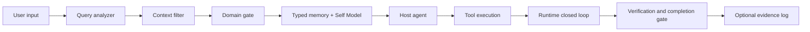

# Hermos Optimization Layer

**Governed self-evolution and runtime integrity for AI agents.**

Hermos is an experimental Python layer for agents that already know how to use
tools, retain memory, and improve over time. It adds controls for a harder
question: how can a learning agent evolve without drifting, mixing unrelated
contexts, or claiming completion without evidence?

Hermos was developed as an independent optimization layer around
[NousResearch/Hermes-Agent](https://github.com/NousResearch/hermes-agent). It is
not an official NousResearch project or an official Hermes Agent release.

## What it adds

- A stable Self Model stored separately from ordinary memory.
- Approval-gated Self Model change proposals.
- Typed memory with different decay and archive rules.
- Configuration-driven query and domain routing.
- Per-turn context filtering and domain isolation.
- A runtime closed loop based on actual tool results.
- A completion gate that distinguishes verification attempts from passing
  verification.
- Optional JSONL evidence records with no implicit home-directory writes.
- Optional interaction-preference onboarding with progressive, context-gated
  follow-up questions.

## Why this is different

Hermes Agent already provides broad self-improvement through memory, skills,
session search, user modeling, and curation. Hermos focuses on governance and
runtime integrity:

> Upstream helps an agent learn. Hermos helps a learning agent avoid identity
> drift, context contamination, and unsupported completion claims.

## Architecture



The host agent remains responsible for model calls and tool execution. Hermos
produces context, signals, and completion decisions; it does not autonomously
retry commands or modify files.

## Quick start

```bash
python -m venv .venv
source .venv/bin/activate
python -m pip install -e ".[dev]"
pytest
```

Minimal Self Model and typed-memory example:

```python
from pathlib import Path

from hermos import HermosCore

core = HermosCore(Path("./runtime-data"))
context = core.build_turn_context(
    "Please review the project tests.",
    current_domains_hint=["[project:sample]"],
)

print(context.filter_output.to_dict())
```

Runtime completion gate:

```python
from hermos.runtime_closed_loop import (
    Observability,
    RiskLevel,
    RuntimeClosedLoopLayer,
    TaskProfile,
    TaskType,
)

profile = TaskProfile(
    task_id="change-1",
    task_type=TaskType.CODE_CHANGE,
    observability=Observability.HIGH,
    risk_level=RiskLevel.MEDIUM,
    profile_source="host",
)
loop = RuntimeClosedLoopLayer(profile)

loop.observe({
    "tool_name": "write_file",
    "arguments": {"path": "example.py"},
    "result": {"content": "updated"},
})
loop.observe({
    "tool_name": "terminal",
    "arguments": {"command": "pytest"},
    "result": {"output": "1 passed", "exit_code": 0},
})

assert loop.on_turn(completion_claimed=True).completion_check.can_complete
```

Adaptive Profile Layer:

```bash
hermos-apl skip --store ./apl-data --user local-user --json
hermos-apl observe \
  --store ./apl-data \
  --user local-user \
  --event '{"effective":true}' \
  --json
hermos-apl next-question \
  --store ./apl-data \
  --user local-user \
  --progressive \
  --json
```

See [docs/ADAPTIVE_PROFILE.md](docs/ADAPTIVE_PROFILE.md) for the CLI contract
and thin-adapter integration loop.

Cross-agent adapters:

- MCP stdio: `hermos-apl mcp --store /absolute/path/to/apl-data`
- Hermos subject sandbox:
  `integrations/hermos_sandbox/adapter.py`
- OpenClaw Plugin + packaged Skill:
  `integrations/openclaw-adaptive-profile/`
- Standalone Agent Skill: `skills/adaptive-profile/`
- Public schemas: `schemas/host-turn.schema.json` and
  `schemas/observation.schema.json`

See [docs/CROSS_AGENT_ADAPTERS.md](docs/CROSS_AGENT_ADAPTERS.md).

Real-model blind A/B demo:

```bash
python examples/real_model_ab_demo.py --dry-run
python examples/real_model_ab_demo.py
```

See [docs/REAL_MODEL_EXPERIMENT.md](docs/REAL_MODEL_EXPERIMENT.md).

## Privacy boundary

The repository intentionally contains no real user memory, conversation logs,
personal project aliases, credentials, or machine-specific paths. Host
applications should load private domain rules and user data from ignored local
configuration.

See [docs/PRIVACY_BOUNDARY.md](docs/PRIVACY_BOUNDARY.md).

## Status

Version `0.5.0-alpha` adds host-neutral lifecycle mapping, MCP stdio, a formal
Hermos subject-sandbox adapter, an OpenClaw Plugin, and a portable Agent Skill.
It has deterministic, current-installed-OpenClaw, and directional real-model
blind A/B validation. It has not yet completed long-running multi-user
evaluation or production gateway rollout.

## License

MIT. See [LICENSE](LICENSE).
